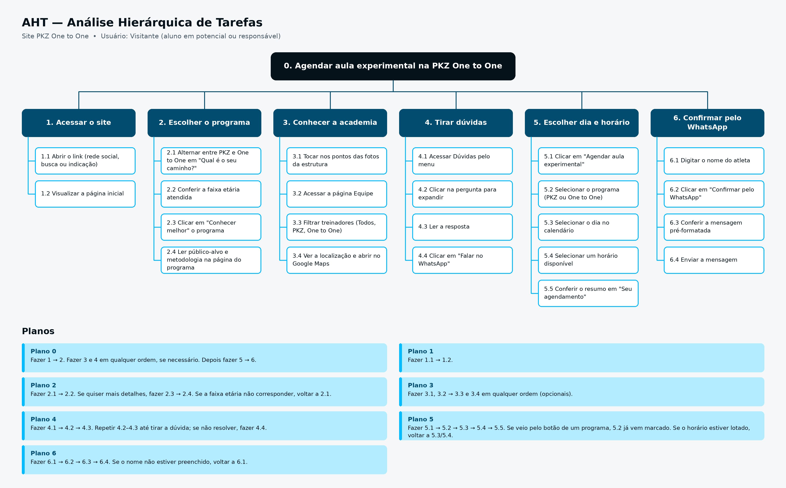

# AHT – Site PKZ One to One

## 1. Definir o objetivo principal

**Objetivo (0): Agendar uma aula experimental na PKZ One to One.**

O usuário principal é o visitante (aluno em potencial ou responsável por um jovem atleta), que acessa o site para entender a diferença entre a PKZ (jovens atletas de 7 a 15 anos) e a One to One (adultos de 17 a 90 anos), conhecer a estrutura e a equipe, tirar dúvidas e agendar a aula experimental, com a confirmação final feita pelo WhatsApp.

## 2. Dividir em subtarefas

1. Acessar o site.
2. Escolher o programa (PKZ ou One to One).
3. Conhecer a academia (estrutura, equipe e localização).
4. Tirar dúvidas na seção de perguntas frequentes.
5. Escolher o dia e o horário da aula experimental.
6. Confirmar o agendamento pelo WhatsApp.

## 3. Organizar hierarquicamente

- **1. Acessar o site**
  - 1.1 Abrir o link (rede social, busca ou indicação).
  - 1.2 Visualizar a página inicial.

- **2. Escolher o programa**
  - 2.1 Alternar entre PKZ e One to One em "Qual é o seu caminho?".
  - 2.2 Conferir a faixa etária atendida.
  - 2.3 Clicar em "Conhecer melhor" o programa.
  - 2.4 Ler o público-alvo e a metodologia na página do programa.

- **3. Conhecer a academia**
  - 3.1 Tocar nos pontos das fotos da estrutura.
  - 3.2 Acessar a página Equipe.
  - 3.3 Filtrar os treinadores (Todos, PKZ, One to One).
  - 3.4 Ver a localização e abrir no Google Maps.

- **4. Tirar dúvidas**
  - 4.1 Acessar Dúvidas pelo menu.
  - 4.2 Clicar na pergunta para expandir.
  - 4.3 Ler a resposta.
  - 4.4 Clicar em "Falar no WhatsApp".

- **5. Escolher dia e horário**
  - 5.1 Clicar em "Agendar aula experimental".
  - 5.2 Selecionar o programa (PKZ ou One to One).
  - 5.3 Selecionar o dia no calendário.
  - 5.4 Selecionar um horário disponível.
  - 5.5 Conferir o resumo em "Seu agendamento".

- **6. Confirmar pelo WhatsApp**
  - 6.1 Digitar o nome do atleta.
  - 6.2 Clicar em "Confirmar pelo WhatsApp".
  - 6.3 Conferir a mensagem pré-formatada.
  - 6.4 Enviar a mensagem.

