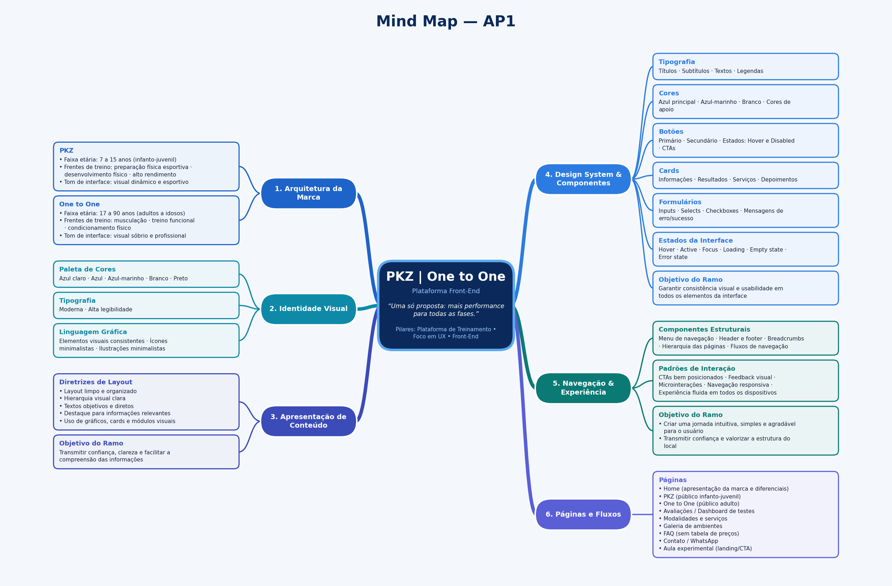

# Mind Map - AP1
---

# [Nó Central] PKZ | One to One (Plataforma Front-End)
> **Proposta Central:** "Uma só proposta: mais performance para todas as fases."  
> **Pilares:** Plataforma de Treinamento • Foco em UX • Front-End

---

- **1. Arquitetura da Marca**
  - **PKZ**
    - Faixa etária: 7 a 15 anos (Infanto-juvenil)
    - Frentes de treino:
      - Preparação física esportiva
      - Desenvolvimento físico
      - Alto rendimento
    - Tom de interface: Visual dinâmico e esportivo
  - **One to One**
    - Faixa etária: 17 a 90 anos (Adultos a idosos)
    - Frentes de treino:
      - Musculação
      - Treino funcional
      - Condicionamento físico
    - Tom de interface: Visual sóbrio e profissional

- **2. Identidade Visual**
  - **Paleta de Cores**
    - Azul claro
    - Azul
    - Azul-marinho
    - Branco
    - Preto
  - **Tipografia**
    - Moderna
    - Alta legibilidade
  - **Linguagem Gráfica**
    - Elementos visuais consistentes
    - Ícones minimalistas
    - Ilustrações minimalistas

- **3. Apresentação de Conteúdo**
  - **Diretrizes de Layout**
    - Layout limpo e organizado
    - Hierarquia visual clara
    - Textos objetivos e diretos
    - Destaque para informações relevantes
    - Uso de gráficos, cards e módulos visuais
  - **Objetivo do Ramo:** Transmitir confiança, clareza e facilitar a compreensão das informações

- **4. Design System & Componentes**
  - **Tipografia**
    - Títulos
    - Subtítulos
    - Textos
    - Legendas
  - **Cores**
    - Azul principal
    - Azul-marinho
    - Branco
    - Cores de apoio
  - **Botões**
    - Primário
    - Secundário
    - Estados: Hover e Disabled
    - CTAs
  - **Cards**
    - Informações
    - Resultados
    - Serviços
    - Depoimentos
  - **Formulários**
    - Inputs
    - Selects
    - Checkboxes
    - Mensagens de erro/sucesso
  - **Estados da Interface**
    - Hover
    - Active
    - Focus
    - Loading
    - Empty state
    - Error state
  - **Objetivo do Ramo:** Garantir consistência visual e usabilidade em todos os elementos da interface

- **5. Navegação & Experiência**
  - **Componentes Estruturais**
    - Menu de navegação
    - Header e footer
    - Breadcrumbs
    - Hierarquia das páginas
    - Fluxos de navegação
  - **Padrões de Interação**
    - CTAs bem posicionados
    - Feedback visual
    - Microinterações
    - Navegação responsiva
    - Experiência fluida em todos os dispositivos
  - **Objetivo do Ramo:** Criar uma jornada intuitiva, simples e agradável para o usuário

- **6. Galeria da Estrutura**
  - **Categorias de Exibição**
    - Equipamentos
    - Ambiente de treino
    - Área interna
    - Espaços para alunos
    - Estrutura disponível
  - **Objetivo do Ramo:** Transmitir confiança e valorizar a estrutura do local

- **7. Páginas e Fluxos**
  - Home (apresentação da marca e diferenciais)
  - PKZ (público infanto-juvenil)
  - One to One (público adulto)
  - Avaliações / Dashboard de testes
  - Modalidades e serviços
  - Galeria de ambientes
  - FAQ (sem tabela de preços)
  - Contato / WhatsApp
  - Aula experimental (landing/CTA)

##### __*Imagem meramente ilustratuva*__